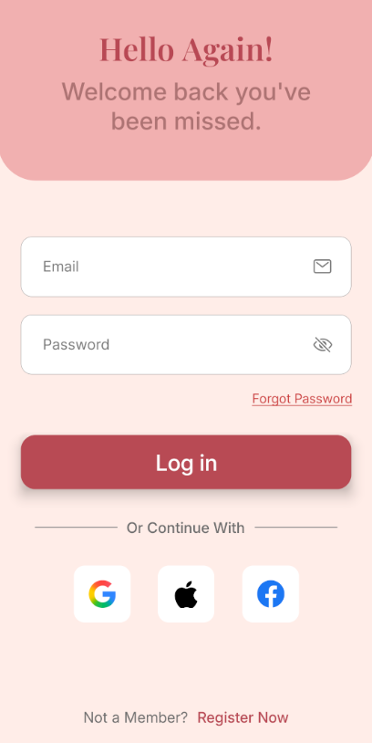

# GlowCart - E-commerce Mobile App

GlowCart is a modern, responsive e-commerce mobile application built with React Native. It features product browsing, cart management, user authentication, and more.

## 🎥 Demo Video

[Click here to watch the demo video](https://drive.google.com/file/d/1NhxpUNqCQJUTLaNarH0LRoS4uBziGiCz/view?usp=sharing)

## ✨ Features

- 🛍️ Browse products with beautiful UI
- 🛒 Add/remove items from cart
- 🔍 Search functionality
- 🔐 User authentication (login/register)
- 📱 Responsive design for all screen sizes

## 📸 Screenshots

### Onboarding Screen


### Login Screen



### Register Screen


### Home Screen


### Profile Screen


### Cart Screen


## 🚀 Installation

### Prerequisites

- npm or yarn
- React Native CLI
- Android Studio / Xcode (for running on emulator/device)

### Setup Instructions

1. **Clone the repository:**
   ```bash
   git clone https://github.com/Abhi3110200/GlowCart.git
   cd GlowCart
   ```

2. **Install dependencies:**
   ```bash
   npm install
   # or
   yarn install
   ```

3. **Install pods (for iOS):**
   ```bash
   cd ios && pod install && cd ..
   ```


4. **Run the app:**
   ```bash
   # For Android
   npx react-native run-android
   
   # For iOS
   npx react-native run-ios
   ```

## 🛠 Tech Stack

- React Native
- TypeScript
- React Navigation
- Firebase
- Zustand (State Management)
- AsyncStorage (Local Storage)
- React Native Vector Icons

## ⏱ Time Taken

- Planning & Setup: 2 hours
- UI Development: 7 hours
- State Management & Firebase Integration: 4 hours
- Testing & Bug Fixes: 2 hours
- Documentation: .5 hours

**Total Time**: ~12 hours

## ⚠️ Known Issues

1. Cart persistence might need re-authentication after app restart
2. Some UI elements may need adjustment on smaller devices
3. Image loading can be slow on slower networks

## 📝 Assumptions

1. User authentication is handled via email/password
2. Product data is fetched from a mock API
3. App is optimized for mobile devices (not tablets)

## 🤝 Contributing

Contributions are welcome! Please feel free to submit a Pull Request.

## 📄 License

This project is licensed under the MIT License - see the [LICENSE](LICENSE) file for details.

## 📧 Contact

For any queries, please contact [abhijeetdrv@gmail.com](mailto:abhijeetdrv@gmail.com)
